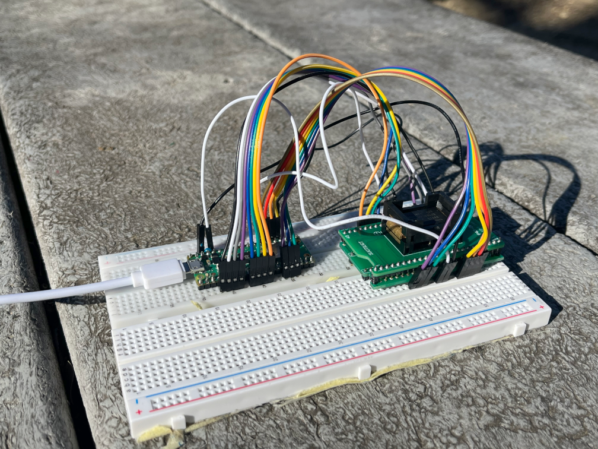

# AlmostFrii

Raspberry Pi Pico controller for Nintendo Wii NAND, HY27UF084G2B/M 512MByte parallel NAND flash or equivalents. This project currently only supports 1:1 NAND flashing i.e. no ECC calculation.



## Features

- Read/Write individual pages by row address (0x00->0x03FFFF)

- Read manufacturer code

- Block (0x00->0xFFF) and full chip erase

- On-chip SHA256 calculation for individual pages or blocks

- Logging for NAND dumps and programs

## Notes

- Page size: **2KB** (2048 valid data +64 ECC bytes, so **2112 bytes** in total)

- Block Size: 64 Pages = **128KB** (**135168 bytes total**) 
- Block count: **4096**

## Hardware Setup

This project requires:
1. Raspberry Pi Pico (basic or W)
2. TSOP48 breakout 
3. [Wii-supported NAND chip](https://wiibrew.org/wiki/Hardware/NAND#Supported_chips)
4. Recommended 0.1uF capacitor across Vss and Vcc.

### Wiring Guide

| Pin  | Pico | NAND     |
|-------|-----|----------|
| R/B | GPIO 11  | 7 |
| RE   | GPIO 12  | 8   |
| CE | GPIO 13  | 9    |
| Vcc | Pin 36  | 12, 37 |
| Vss   | Pin 38  | 13, 36   |
| CLE | GPIO 16  | 18 |
| ALE   | GPIO 17  | 19   |
| WE | GPIO 18  | 20    |
| WP | GPIO 19  | 21    |
| IO0 | GPIO 2  | 29    |
| IO1 | GPIO 3  | 30    |
| IO2 | GPIO 4  | 31    |
| IO3 | GPIO 5  | 32    |
| IO4 | GPIO 6  | 41    |
| IO5 | GPIO 7  | 42    |
| IO6 | GPIO 8  | 43    |
| IO7 | GPIO 9  | 44    |

## Basic Usage

### Dumping NAND

To dump the full NAND, run:

 ```bash
 python ./nand_dump.py -P"/your/port"
 ``` 
replacing `/your/port` with whatever serial port your Pi Pico shows up as.

### Writing NAND

When writing a NAND backup to another NAND, it is probably a good idea to erase the chip first.

In a serial monitor such as the Arduino IDE, VS Code serial monitor, PuTTY, etc. enter

```bash
$NANDErase$me
```

and wait for the chip to complete full erasure. Then, **after closing the monitor**, run

 ```bash
 python ./nand_program.py ./path-to-file -wb -4096 -a0 -P"/your/port"
 ``` 

 again replacing `/your/port`, and `./path-to-file` with the path to your NAND backup.


## Advanced Usage

### Python Scripts

- **nand_dump.py**: automatically dumps entire chip to `nand_dumps/nand-{epoch}.bin`. Takes ~20min.

- **program.py**: programs NAND chip from file input and computes SHA256 per-block and per-page. takes ~1.5hrs.

## `nand_dump.py` Arguments

- `P` sets the port to use

- `l` sets the **l**ength of blocks to read (default 4096)

- `a` sets the block **a**ddress **in hex** to begin reading (default 0)

- `d` enables command **d**ebug mode, quitting program before NAND interfacing begins

## `nand_dump.py` Examples

### Example 1
 ```bash
 python ./nand_dump.py -P"/dev/tty.usbmodem101" -l800 -a800
 ```

- Dumps 800 pages of NAND starting from block address 0x800 (2048) using `/dev/tty.usbmodem101`

**output:**

```bash
Reading 800 blocks from start address 2048 with port COM13.
```

### Example 2
 ```bash
 python ./nand_dump.py -P"/dev/tty.usbmodem101"
 ``` 

- Dumps entire NAND using `/dev/tty.usbmodem101`

**output:**

```bash
Reading 4096 blocks from start address 0 with port COM13.
```

## `nand_program.py` Arguments

- `w` enables write mode

- `t` enables **t**est write mode ("writes pattern `0xAD`)

- `p` enables per-**p**age SH256A calculation
- `P` sets the port to use

- `b` enables per-**b**lock SHA256 calculation (enabled by default)

    - May be disabled with `B`

- `l` sets the **l**ength of write in blocks (default 0)

- `a` sets the block **a**ddress **in hex** to begin writing (default 0)
    - **NOTE:** this begins writing the NAND image relative to 0 at the specified address i.e. the arguments `-a8 -l8` will write blocks 8-15 from the selected NAND image, skipping blocks 0-7.  

- `d` enables command **d**ebug mode, quitting program before NAND interfacing begins

## `nand_program.py` Examples

### Example 1
 ```bash
 python ./nand_program.py ./path-to-file -wpbd -l60 -aA8 -P"/dev/tty.usbmodem101"
 ```  

- Starting from the address of block `0xA8`, will write 60 blocks to NAND using port `/dev/tty.usbmodem101` provided file and computes per-block and per-page SHA256, but exits program after printing debug message.

**output:**

```bash
Doing write from image ./path-to-file with per-page and per-block SHA256 calculation, starting at block address 0xa8 for 60 blocks
```

\*program exits\*

### Serial Commands

These commands are intended to be typed into a serial monitor such as PuTTY. 

 
**NOTE: ALL HEX ADDRESSES MUST BE UPPERCASE!!**

- `$id$me` - print out NAND chip ID (should be: `ad dc 10 95`) 

- `$pr$me` - read a page, with hex address input

    - usage: `&3F$pr$me` reads page `0x3F`

- `$BLOCKErase$me` - erase block, with hex address input

    - usage: `&3F$BLOCKErase$me` erases page `0x3F`

- `$NANDErase$me` - erases entire NAND chip

- `$pwt$me` - write page full of test string `quickbrownfox` 

    - usage: `&3F$pwt$me` writes page `0x3F` of test string

- `$bsha$me` - compute SHA256 hash of block at given address
    - usage: `&3F$bsha$me` computes SHA256 hash of block `0x3F`

- `$psha$me` - compute SHA256 hash of page at given address
    - usage: `&3F$psha$me` computes SHA256 hash of page `0x3F`

    ## Credits

    This project would not be possible without the incredible documentation and reverse-engineering efforts of the people at [wiibrew.org](https://wiibrew.org/wiki/Hardware/NAND)